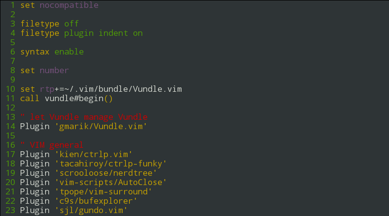

# vim-toggle-quick-fix
Wrapping my function to toggle quick fix window into it's own plugin

**NOTE**
Based on information and code I obtained from [vim.wikia.com/](http://vim.wikia.com/wiki/Toggle_to_open_or_close_the_quickfix_window)

## Installation
Using Vundle
```
Plugin 'gangleri/vim-toggle-quick-fix'
```
By default I have bound &lt;leader&gt;qf as the short cut.


